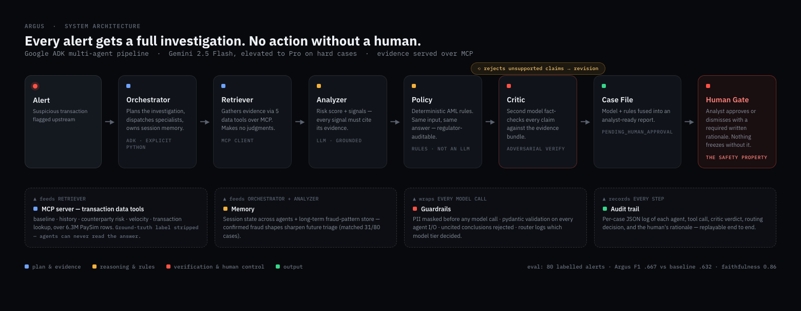
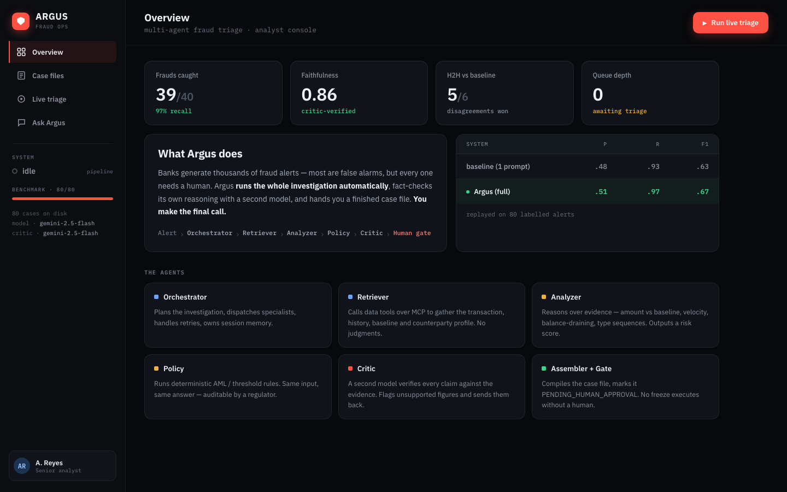
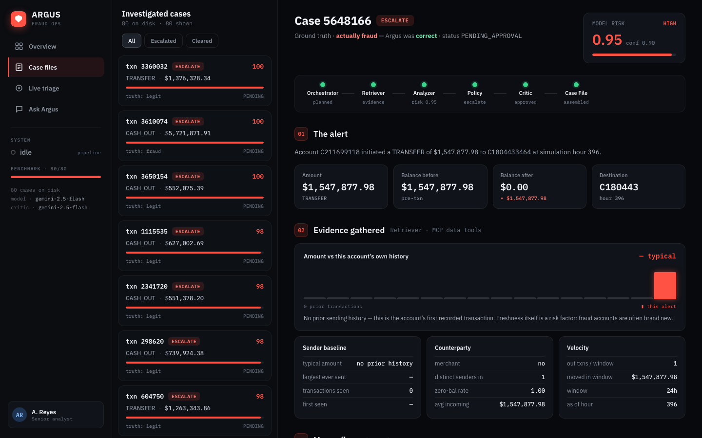
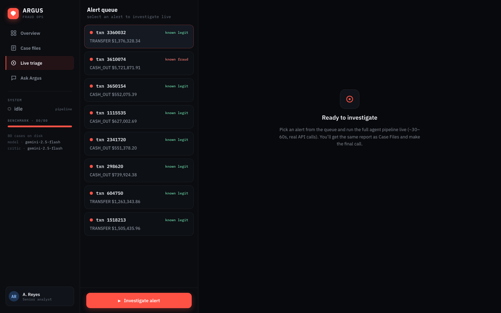

# Argus — Multi-Agent Fraud Triage & Investigation Assistant

**Every fraud alert arrives at the analyst's desk already investigated — evidence
gathered, reasoning fact-checked, policy applied — and nothing gets frozen until a
human signs off.** That's Argus in one sentence.

Kaggle **AI Agents: Intensive Vibe Coding** capstone — *Agents for Business* track.
Built with **Google ADK + Gemini**, evaluated on [PaySim](https://www.kaggle.com/datasets/ealaxi/paysim1).



## The 60-second version

1. A suspicious transaction lands in the queue.
2. Six specialist agents investigate it the way a human analyst would: one **gathers
   evidence** (the account's history, who's receiving the money, how fast funds are
   moving), one **reasons** over that evidence, one applies **deterministic AML rules**,
   and a **Critic** — a second model — fact-checks every claim against the evidence
   and bounces anything unsupported back for revision.
3. The analyst gets a finished case file with a recommendation — and makes the only
   decision that counts. Approving or dismissing requires a **written rationale**,
   and every step of the investigation (including that rationale) is in a replayable
   audit trail.

Why not just ask one LLM "is this fraud?" Because a single prompt has no real
evidence, can't be audited, and will confidently hallucinate a justification — and in
fraud, a made-up reason that triggers a real account freeze is worse than no answer.
We measured exactly that: the one-prompt baseline scores below Argus on every metric
(see [Results](#results--single-agent-baseline-vs-full-argus)).

## The problem

Fraud ops teams drown in transaction alerts — most are false positives, but every one
needs a human to pull the transaction, gather the customer's context, check policy,
and write a defensible decision. It's slow, inconsistent, and doesn't scale.

## What Argus does

Argus runs the investigation a human analyst would — as a team of specialist agents —
and hands the human a finished, fact-checked case file. **No freeze or block ever
executes without human approval.**

- **Orchestrator** plans the investigation, dispatches specialists, owns session memory.
- **Retriever** gathers evidence by calling five transaction data tools **over an MCP
  server** — customer baseline, history, counterparty risk profile, velocity signals.
  It makes no judgments.
- **Analyzer** reasons over the evidence bundle and outputs a risk score plus signals,
  each of which **must cite the specific evidence that supports it**.
- **Policy** is a deterministic rules engine (AML-style thresholds) — *not* an LLM —
  because a regulator wants to see the exact rule that fired.
- **Critic** (a second model call with an adversarial role) fact-checks every claim
  against the actual evidence bundle. Hallucinated figures and uncited conclusions are
  rejected and the case goes back for revision.
- **Case Assembler** fuses the model risk score with the policy verdict and emits a
  case file marked `PENDING_HUMAN_APPROVAL`.
- **Model router** keeps costs sane: routine cases run entirely on Gemini Flash;
  ambiguous scores, model-vs-policy disagreements, and $1M+ high-stakes calls are
  elevated to Gemini 2.5 Pro. The routing decision is itself logged to the audit trail.

## Capstone concepts demonstrated

| Concept | Where |
|---|---|
| Multi-agent system (ADK) | Orchestrator + 6 specialist agents (`agents/`) |
| MCP server | Transaction data tools served over MCP (`tools/mcp_server.py`) |
| Security & guardrails | PII masking, schema validation, evidence-citation check, human approval gate (`guardrails/`) |
| Memory | Session state + long-term fraud-pattern store (`memory/`) |
| Evaluation | Baseline-vs-Argus harness + LLM-judge faithfulness (`eval/`) |
| Observability | Per-case JSON audit trail of every step and tool call (`observability/`) |
| Deployability | FastAPI service + Dockerfile, one-command Cloud Run deploy |

## The analyst workbench

A dark security-console UI where the analyst reviews investigated cases, watches the
pipeline run live on a queued alert, approves/dismisses with a **required, logged
rationale**, and asks grounded questions about a case (answers come only from that
case's record).







Every case file shows the full investigation: the alert, the evidence gathered over
MCP, where the money went, which policy rules fired, what the Critic rejected and
approved, how model + rules were fused — and section 08 is the human gate: nothing is
escalated or cleared until the analyst confirms with a written rationale, which is
appended to the case's audit trail.

## Results — single-agent baseline vs. full Argus

80 balanced PaySim alerts (40 fraud / 40 legitimate look-alikes), scored against the
held-out `isFraud` label. Faithfulness = LLM-as-judge score of how well each case's
stated reasoning is supported by its actual evidence.

| System | Precision | Recall | F1 | Faithfulness |
|---|---|---|---|---|
| Single-agent baseline (1 prompt, no tools) | .481 | .925 | .632 | n/a |
| **Argus (full)** | **.506** | **.975** | **.667** | **0.86** |

Argus caught **39 of 40 frauds** and won **5 of the 6 head-to-head disagreements**
with the baseline — recovering 3 frauds the baseline missed and correctly clearing
2 false alarms the baseline escalated. Precision is intentionally hard here: the
"legitimate" alerts are $550K–$1.5M transfers chosen to look like fraud, so size
alone can't separate them. The `isFraud` label is used **only** for scoring — the
data tools strip it, so agents can never read the answer.

## Quickstart

Requires Python 3.11+ and a free Google AI Studio key
([aistudio.google.com/apikey](https://aistudio.google.com/apikey)).

```bash
pip install -r requirements.txt
cp .env.example .env              # paste your GOOGLE_API_KEY
python -m data.load_data          # download PaySim (6.3M rows) + build the eval set
python demo.py                    # trace one alert end-to-end in the terminal
python -m eval.run_eval           # full eval: baseline vs Argus (checkpointed, resumable)
```

Launch the workbench (serves the UI and the API):

```bash
uvicorn serve:app --port 8080     # then open http://localhost:8080
```

## Deploy (Cloud Run)

```bash
# local container
docker build -t argus .
docker run -p 8080:8080 -e GOOGLE_API_KEY=$GOOGLE_API_KEY argus
curl -X POST localhost:8080/triage -H 'content-type: application/json' -d '{"txn_id": 6102387}'

# Google Cloud Run
gcloud run deploy argus --source . --region us-central1 \
  --set-env-vars GOOGLE_API_KEY=$GOOGLE_API_KEY --allow-unauthenticated
```

The service only ever *recommends* — every case returns `PENDING_HUMAN_APPROVAL`.

## Security & guardrails

- **PII masking** — account identifiers are masked before any model call and restored
  only in the final local case file.
- **Schema validation** — pydantic models validate every agent's input and output;
  malformed output triggers a bounded retry, never a silent pass-through.
- **Evidence citation** — conclusions without supporting evidence are rejected by the
  Critic and the validation layer.
- **Label isolation** — the eval ground truth (`isFraud`) is stripped by the data
  tools; agents cannot investigate by reading the answer.
- **Human gate** — the case file is a recommendation. Freezing an account requires an
  explicit human confirm with a written rationale, and both are written to the audit
  trail (with undo).

## Repo map

```
agents/         orchestrator, retriever, analyzer, policy, critic, case_assembler, router
tools/          data tool functions + MCP server (data_tools.py, mcp_server.py)
guardrails/     PII masking, pydantic I/O validation
memory/         session state + long-term fraud-pattern store
observability/  per-case JSON audit trail
eval/           eval runner, single-agent baseline, LLM-as-judge faithfulness
workbench/      analyst console UI (served by serve.py at /)
notebook/       Kaggle-ready notebook (full pipeline + eval)
docs/           design handoff for the workbench UI + screenshots
serve.py        FastAPI service: POST /triage + workbench API
demo.py         one-alert end-to-end trace
results/        eval checkpoints, metrics.csv, workbench case cache
```
